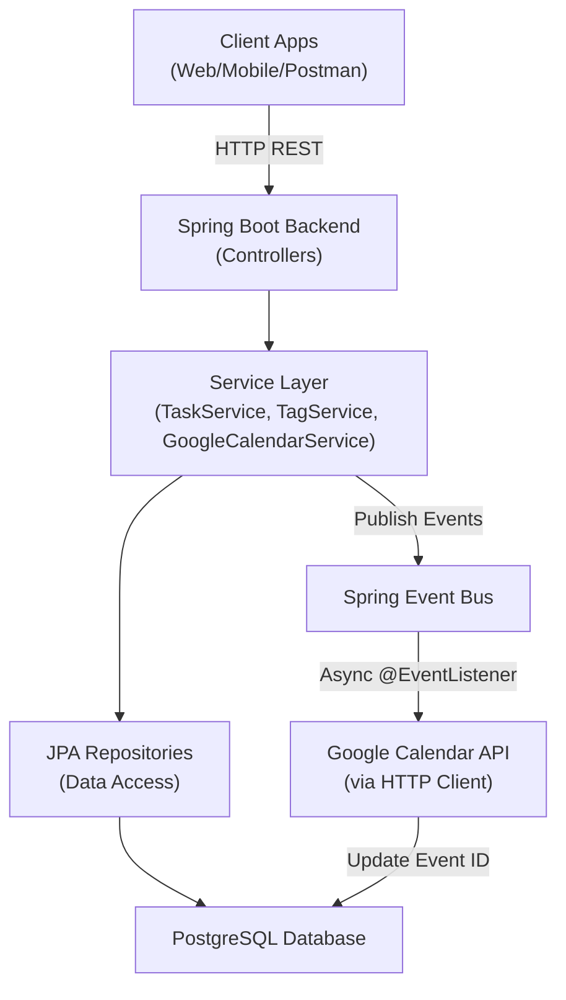
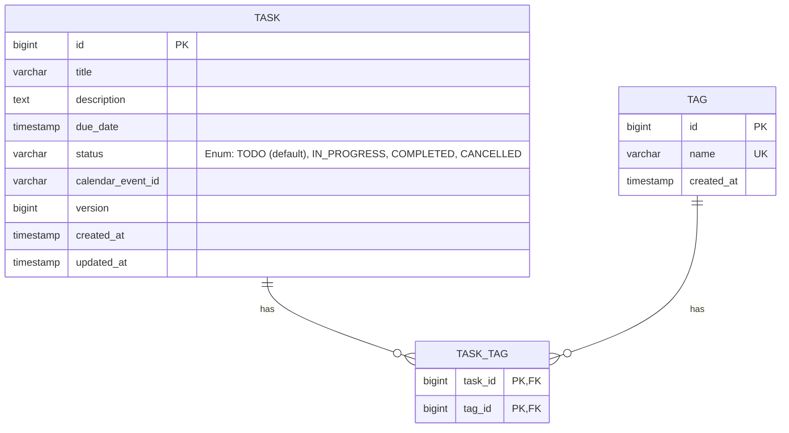
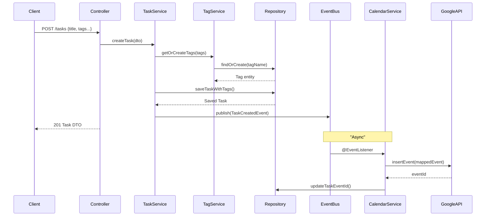
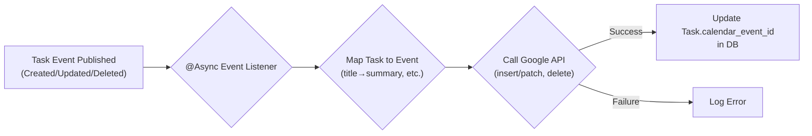
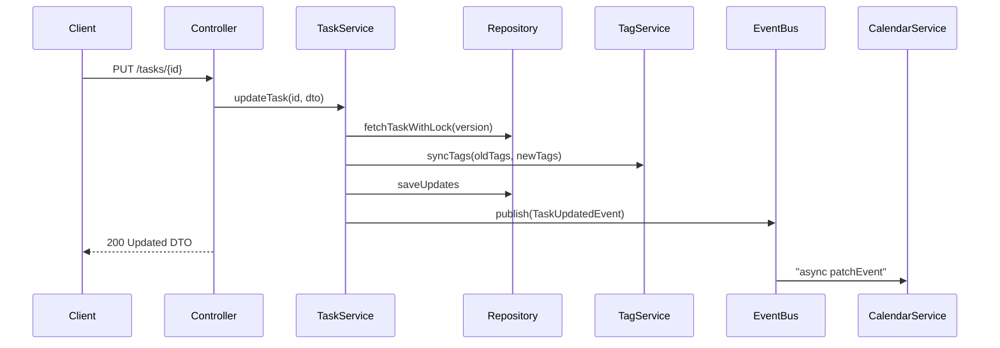

## General app architecture

```mermaid
graph TD
    A["Client Apps<br>(Web/Mobile/Postman)"] -->|HTTP REST| B["Spring Boot Backend<br>(Controllers)"]
    B --> C["Service Layer<br>(TaskService, TagService, GoogleCalendarService)"]
    C --> D["JPA Repositories<br>(Data Access)"]
    D --> E["PostgreSQL Database"]
    C -->|"Publish Events"| F["Spring Event Bus"]
    F -->|"Async @EventListener"| G["Google Calendar API<br>(via HTTP Client)"]
    G -->|"Update Event ID"| E
```
## Entities

```mermaid
erDiagram
    TASK ||--o{ TASK_TAG : "has"
    TAG ||--o{ TASK_TAG : "has"
    TASK {
        bigint id PK
        varchar title
        text description
        timestamp due_date
        varchar status  "Enum: TODO (default), IN_PROGRESS, COMPLETED, CANCELLED"
        varchar calendar_event_id
        bigint version
        timestamp created_at
        timestamp updated_at
    }
    TAG {
        bigint id PK
        varchar name UK
        timestamp created_at
    }
    TASK_TAG {
        bigint task_id PK, FK
        bigint tag_id PK, FK
    }
```
## Create Task Flow

```mermaid
sequenceDiagram
    participant Client
    participant Controller
    participant TaskService
    participant TagService
    participant Repository
    participant EventBus
    participant CalendarService

    Client->>Controller: POST /tasks {title, tags...}
    Controller->>TaskService: createTask(dto)
    TaskService->>TagService: getOrCreateTags(tags)
    TagService->>Repository: findOrCreate(tagName)
    Repository-->>TagService: Tag entity
    TaskService->>Repository: saveTaskWithTags()
    Repository-->>TaskService: Saved Task
    TaskService->>EventBus: publish(TaskCreatedEvent)
    Controller-->>Client: 201 Task DTO
    Note over EventBus,CalendarService: "Async"
    EventBus->>CalendarService: @EventListener
    CalendarService->>GoogleAPI: insertEvent(mappedEvent)
    GoogleAPI-->>CalendarService: eventId
    CalendarService->>Repository: updateTaskEventId()
```

## Google Calendar Sync

```mermaid
flowchart LR
    A["Task Event Published<br/>(Created/Updated/Deleted)"] --> B{"@Async Event Listener"}
    B --> C{"Map Task to Event<br/>(title→summary, etc.)"}
    C --> D{"Call Google API<br/>(insert/patch, delete)"}
    D -->|Success| E["Update Task.calendar_event_id<br/>in DB"]
    D -->|Failure| F["Log Error<br/>"]
```
## Update Task Flow

```mermaid
sequenceDiagram
    Client->>Controller: PUT /tasks/{id}
    Controller->>TaskService: updateTask(id, dto)
    TaskService->>Repository: fetchTaskWithLock(version)
    TaskService->>TagService: syncTags(oldTags, newTags)
    TaskService->>Repository: saveUpdates
    TaskService->>EventBus: publish(TaskUpdatedEvent)
    Controller-->>Client: 200 Updated DTO
    EventBus->>CalendarService: "async patchEvent"
```